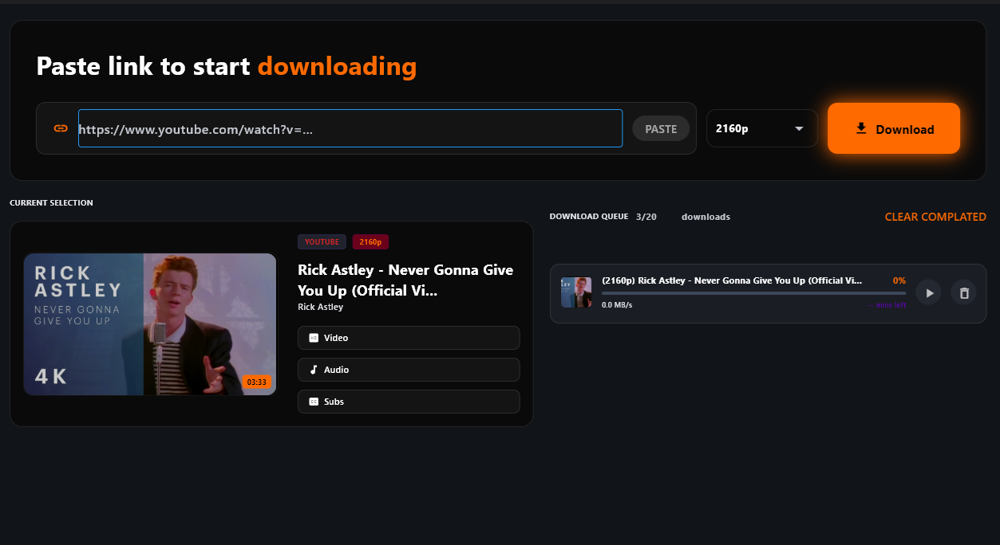
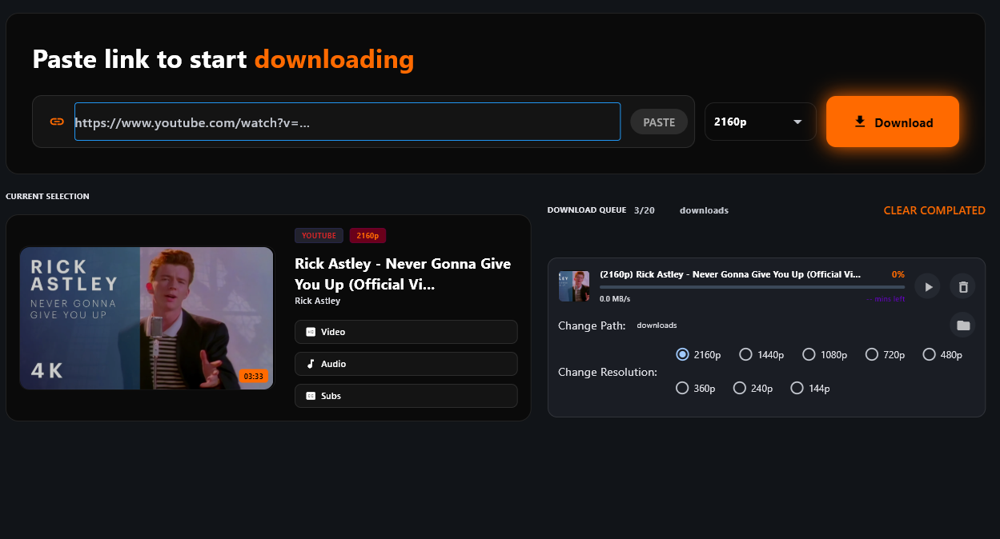

# 🚀 Modern YouTube Downloader

<div align="center">


<p align="center">
  
  
</p>

**A high-performance, modern YouTube downloader built with Python, Flet (Flutter for Python), and yt-dlp.**

*Offering a beautiful user interface to download videos in ultra-high resolution without dealing with complex command lines.*

[🚀 Quick Start](#️-installation--setup) • [✨ Features](#-features-in-detail) • [📖 Documentation](#️-how-it-works) • [🤝 Contributing](#-contributing)

</div>

---

## ✨ Features in Detail

<table>
<tr>
<td width="50%">

### 📺 **Ultra HD Support (4K)**
Unlike many downloaders, this tool can fetch **4K resolution** videos. It intelligently merges video and audio streams for a perfect 4K experience.

### ⚡ **Simultaneous Downloads**
Built with **asynchronous processing**, allowing you to download **multiple videos at once** without freezing the application.

</td>
<td width="50%">

### 🎨 **Modern UI/UX**
Leveraging **Flet** to provide a native-like experience with smooth transitions, responsive layouts, and a clean aesthetic.

### ⚙️ **Advanced Engine**
Powered by **yt-dlp**, the most robust and up-to-date downloading engine available today.

</td>
</tr>
</table>

### 🛠️ **Lossless Processing**
Uses **FFmpeg** to ensure that merging high-quality video (VP9/AV1) and audio (DASH) happens without any quality loss.

---

## 🎯 Key Highlights

```
✅ 4K Video Support          ✅ Multi-threaded Downloads     ✅ Modern Flutter UI
✅ Audio Quality Preservation ✅ Progress Tracking            ✅ FFmpeg Integration
✅ Format Selection          ✅ Queue Management             ✅ Cross-platform
```

---

## ⚙️ Installation & Setup

### 📋 Prerequisites

Before you begin, ensure you have the following installed:

#### 1️⃣ **Install FFmpeg** (Required ⚠️)

FFmpeg is the backbone of high-resolution media processing.

🔗 **Download:** [FFmpeg Official Website](https://ffmpeg.org/download.html)

⚡ **Important:** After downloading, ensure the `bin` folder is added to your **System PATH**.

<details>
<summary>💡 Click here for PATH setup instructions</summary>

**Windows:**
1. Download FFmpeg and extract it (e.g., `C:\ffmpeg`)
2. Right-click "This PC" → Properties → Advanced System Settings
3. Click "Environment Variables"
4. Edit "Path" and add `C:\ffmpeg\bin`
5. Click OK and restart your terminal

**macOS:**
```bash
brew install ffmpeg
```

**Linux:**
```bash
sudo apt install ffmpeg  # Ubuntu/Debian
sudo dnf install ffmpeg  # Fedora
```

</details>

#### 2️⃣ **Install Python Dependencies**

Open your terminal and run the following command to install the necessary libraries:

```bash
pip install flet yt-dlp
```

⚠️ **Note on yt-dlp:** YouTube frequently updates its platform. To avoid errors, ensure you always have the **latest version** of `yt-dlp`.

You can update it anytime using:
```bash
pip install -U yt-dlp
```

---

## 🚀 Quick Start

### Running the Application

```bash
# Clone the repository
git clone https://github.com/TheFhoeniXs/youtube-downloader.git
cd youtube-downloader

# Run the application
python main.py
```

### 🎬 Usage Flow

```
1. 📋 Paste YouTube URL →
2. 🎯 Select Quality (4K/1080p/720p) →
3. 📁 Choose Download Location →
4. ⬇️ Click Download →
5. 📊 Watch Progress in Real-time →
6. ✅ Enjoy Your Video! 🎉
```

---

## 🛠️ How it Works

The app follows a **professional pipeline** to ensure quality:

<div align="center">

**🔍 Metadata Fetching** → **🎯 Stream Selection** → **⚡ Parallel Download** → **🎬 FFmpeg Merge** → **✅ Final Video**

</div>

### 🔧 Technical Pipeline

| Step | Description | Technology |
|------|-------------|------------|
| 1️⃣ **Metadata Fetching** | Retrieves video info and available formats | `yt-dlp` API |
| 2️⃣ **Stream Selection** | Automatically picks the highest quality video and audio streams | Smart Algorithm |
| 3️⃣ **Parallel Download** | Downloads components simultaneously to save time | Async/Await |
| 4️⃣ **FFmpeg Merge** | Combines components into a single `.mp4` or `.mkv` container | FFmpeg |

---

## 📁 Project Structure

```
youtube-downloader/
├── 🎯 main.py                          # Application entry point
├── 📦 src/
│   ├── __init__.py                     # Package initializer
│   ├── 🎨 ui/
│   │   ├── components.py               # Main UI components
│   │   └── style.py                    # Main UI style
│   ├── 📥 models/
│   │   ├── downloader.py               # Download logic
│   │   ├── validators.py               # Vfor verifications and checks
│   │   └── video_info.py               # captures the video data
│   └── 📁 assets/
│       ├── icons/                       # Application icons
│       └── screenshots/                 # UI screenshots
├── 📋 requirements.txt                  # Python dependencies
├── 🚫 .gitignore                        # Git ignore rules
├── 📜 LICENSE                           # MIT License
└── 📖 README.md                         # This file
```

---

## 🎨 Screenshots

<div align="center">

### 🖥️ Main Interface


### 📊 Download Progress


</div>

---

## 📅 Roadmap / Upcoming Updates

We are committed to making this the **best open-source downloader**. Here's what's coming:

### 🎯 Priority Features

- [x] ✅ 4K video support
- [x] ✅ Simultaneous downloads
- [x] ✅ Modern UI with Flet
- [ ] 🎵 **MP3 Mode**: Direct conversion to high-quality audio formats
- [ ] 📂 **YouTube Playlists**: Download entire playlists or channels with a single click
- [ ] 🌙 **Dark/Light Theme**: Toggle between themes
- [ ] 📝 **Subtitle Download**: Auto-download available subtitles
- [ ] 🔔 **Download Notifications**: Get notified when downloads complete
- [ ] 📱 **Mobile Support**: Android/iOS versions

### 🔧 Technical Improvements

- [ ] ✨ **UI Overhaul**: Even more customizable themes and animations
- [ ] 🛡️ **Bug Fixes**: Continual code refactoring for a "crash-free" experience
- [ ] 🚀 **Stability**: Optimized resource management for lower RAM usage during 4K processing
- [ ] ⚡ **Speed Optimization**: Faster download speeds with enhanced algorithms
- [ ] 💾 **Smart Caching**: Resume interrupted downloads automatically

---

## 🎯 Supported Formats

### 📹 Video Qualities

| Quality | Resolution | Bitrate | Use Case |
|---------|-----------|---------|----------|
| 🎬 **4K** | 3840x2160 | ~50 Mbps | High-end displays |
| 📺 **1080p** | 1920x1080 | ~8 Mbps | Standard HD |
| 📹 **720p** | 1280x720 | ~5 Mbps | HD streaming |
| 📱 **480p** | 854x480 | ~2.5 Mbps | Mobile devices |
| 📞 **360p** | 640x360 | ~1 Mbps | Low bandwidth |

### 🎵 Audio Formats

- 🎼 **AAC** (128-256 kbps)
- 🎺 **Opus** (160 kbps)
- 🎸 **MP3** (320 kbps) *(Coming Soon)*
- 🎹 **FLAC** (Lossless) *(Coming Soon)*

---

## 🤝 Contributing

<div align="center">

**Contributions make the open-source community an amazing place to learn, inspire, and create!**

*Any contributions you make are **greatly appreciated**.*

</div>

### 📝 How to Contribute

1. 🍴 **Fork the Project**
2. 🌿 **Create your Feature Branch**
   ```bash
   git checkout -b feature/AmazingFeature
   ```
3. 💾 **Commit your Changes**
   ```bash
   git commit -m 'Add some AmazingFeature'
   ```
4. 📤 **Push to the Branch**
   ```bash
   git push origin feature/AmazingFeature
   ```
5. 🎯 **Open a Pull Request**

### 🐛 Found a Bug?

Please open an issue with:
- 📝 Clear description of the problem
- 🔄 Steps to reproduce
- 💻 Your environment (OS, Python version, etc.)
- 📸 Screenshots if applicable

---

## 📜 License

<div align="center">

Distributed under the **MIT License**. See [`LICENSE`](LICENSE) for more information.

```
MIT License - Feel free to use, modify, and distribute!
```

</div>

---

## ⚠️ Disclaimer

<div align="center">

**Important Notice:**

This tool is intended for **personal and educational use only**.

Please respect copyright laws and YouTube's Terms of Service.

🚫 Do not use this tool to:
- Download copyrighted content without permission
- Redistribute downloaded content
- Violate YouTube's Terms of Service

✅ Recommended uses:
- Personal video backup
- Educational purposes
- Content you own or have rights to
- Public domain content

</div>

---

## 💡 FAQ

<details>
<summary><b>❓ Why do I need FFmpeg?</b></summary>

FFmpeg is required to merge high-quality video and audio streams. YouTube stores 4K+ videos and audio separately, and FFmpeg combines them seamlessly.

</details>

<details>
<summary><b>❓ Which quality should I choose?</b></summary>

- **4K**: For high-end displays and archiving
- **1080p**: Best balance of quality and file size
- **720p**: Quick downloads with good quality
- **480p/360p**: For mobile or low storage

</details>

<details>
<summary><b>❓ Can I download age-restricted videos?</b></summary>

Currently, the app may have limitations with age-restricted content. This is being addressed in future updates.

</details>

<details>
<summary><b>❓ How do I update yt-dlp?</b></summary>

Simply run:
```bash
pip install -U yt-dlp
```

</details>

---

## 🌟 Showcase

<div align="center">

```
╔══════════════════════════════════════════════════════╗
║                                                      ║
║        🚀 Modern YouTube Downloader 📥              ║
║                                                      ║
║     ✨ High Quality • Fast • User Friendly ✨       ║
║                                                      ║
╚══════════════════════════════════════════════════════╝
```

</div>

---

## 🎉 Credits & Acknowledgments

<div align="center">

### 👨‍💻 Developed by

**[TheFhoeniXs](https://github.com/TheFhoeniXs)**

### 🙏 Special Thanks

- 🎨 **[Flet Team](https://flet.dev)** - For the amazing UI framework
- 📥 **[yt-dlp Contributors](https://github.com/yt-dlp/yt-dlp)** - For the powerful download engine
- 🛠️ **[FFmpeg Team](https://ffmpeg.org)** - For video processing capabilities
- ☕ **Coffee** - For keeping the developer awake during late-night coding sessions
- ⭐ **All Contributors & Stargazers** - For believing in this project

</div>

---

## 📊 Project Stats

<div align="center">


</div>

---

## 🔗 Quick Links

<div align="center">

| Resource | Link |
|----------|------|
| 📖 **Documentation** | [Read the Docs](https://github.com/TheFhoeniXs/youtube-downloader/wiki) |
| 🐛 **Bug Reports** | [Issue Tracker](https://github.com/TheFhoeniXs/youtube-downloader/issues) |
| 💬 **Discussions** | [GitHub Discussions](https://github.com/TheFhoeniXs/youtube-downloader/discussions) |
| 🔄 **Changelog** | [Release Notes](https://github.com/TheFhoeniXs/youtube-downloader/releases) |
| 💖 **Sponsor** | [Support Development](https://github.com/sponsors/TheFhoeniXs) |

</div>

---

<div align="center">

### 🎯 Happy Downloading! 📥✨

**Made with 💙 and lots of ☕**

⭐ **If you like this project, please give it a star!** ⭐

---

*Built with [Python](https://www.python.org/) • Powered by [yt-dlp](https://github.com/yt-dlp/yt-dlp) • UI by [Flet](https://flet.dev)*

**[⬆ Back to Top](#-modern-youtube-downloader)**

</div>